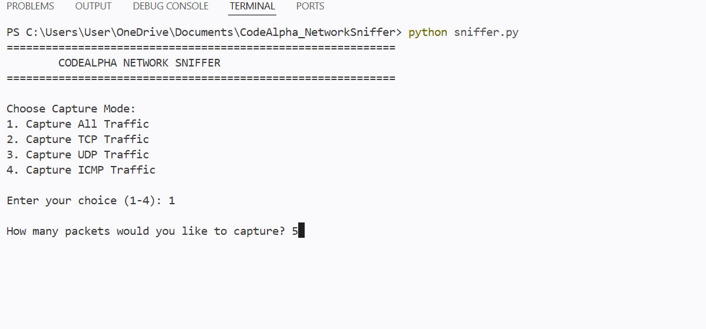
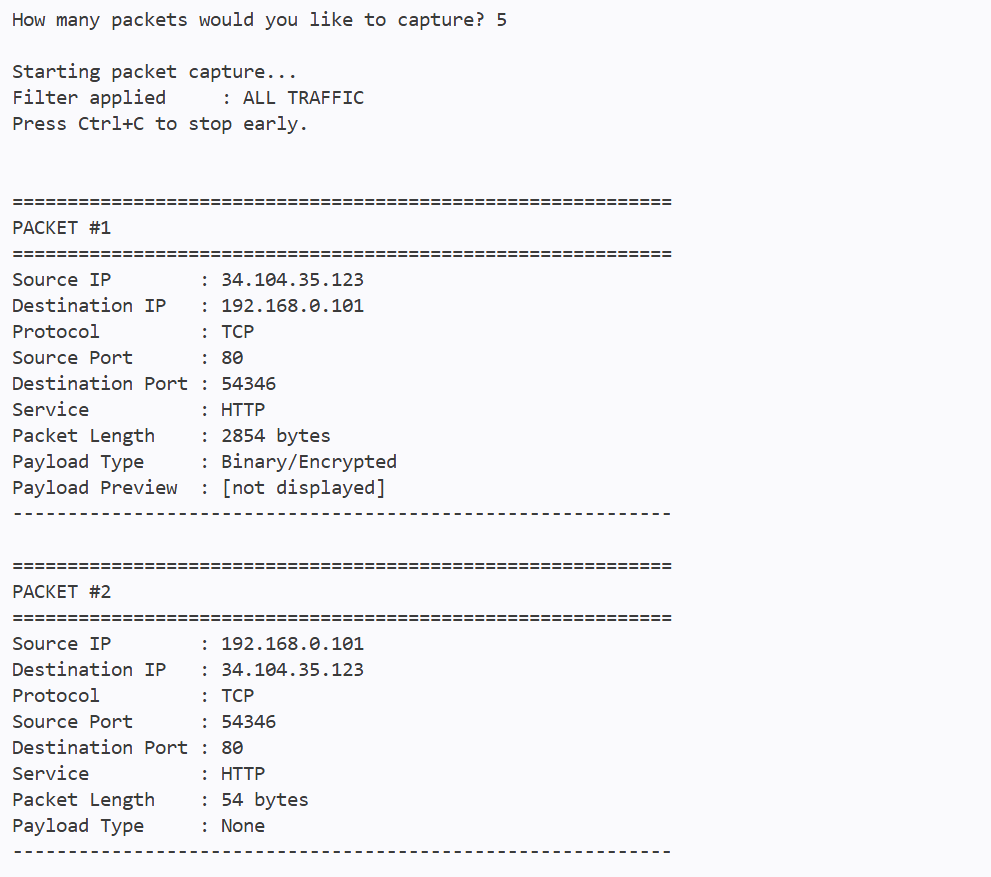
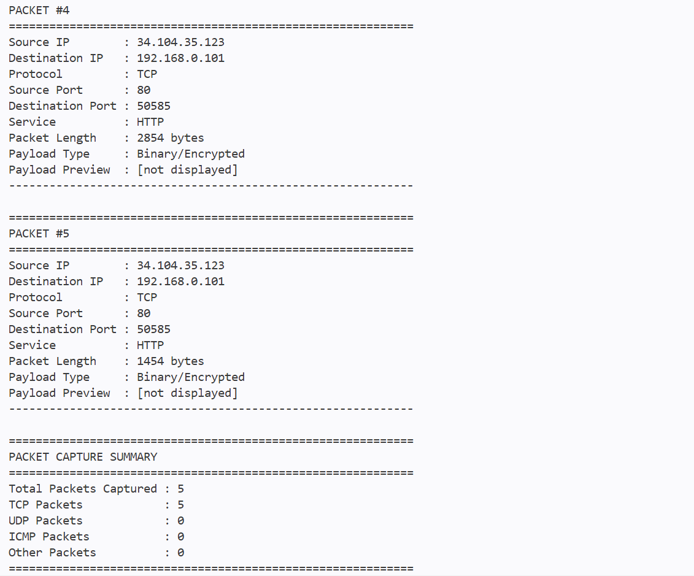

# CodeAlpha Network Sniffer

A Python-based network packet sniffer developed as part of the CodeAlpha Cyber Security Internship.

## Project Overview

The Network Sniffer is a cybersecurity tool designed to capture and analyze network packets in real time. It uses the Scapy library to inspect network traffic and extract important packet information such as source and destination IP addresses, protocols, ports, services, packet length, and payload characteristics.

The project demonstrates fundamental concepts of network security, packet analysis, network protocols, and defensive cybersecurity.

## Objectives

The main objectives of this project are to:

- Capture network packets in real time.
- Identify source and destination IP addresses.
- Identify network protocols such as TCP, UDP, and ICMP.
- Display source and destination ports.
- Identify common network services such as HTTP, HTTPS, DNS, and SSDP.
- Display packet length.
- Analyze packet payload characteristics.
- Provide traffic filtering options.
- Generate packet capture statistics.

## Technologies Used

- **Programming Language:** Python
- **Packet Analysis Library:** Scapy
- **Development Environment:** Visual Studio Code
- **Operating System:** Windows

## Project Structure

```text
CodeAlpha_NetworkSniffer/
│
├── sniffer.py
├── requirements.txt
├── README.md
│
└── screenshots/

## Screenshots

### Capture Mode


### Packet Analysis


### Capture Summary

